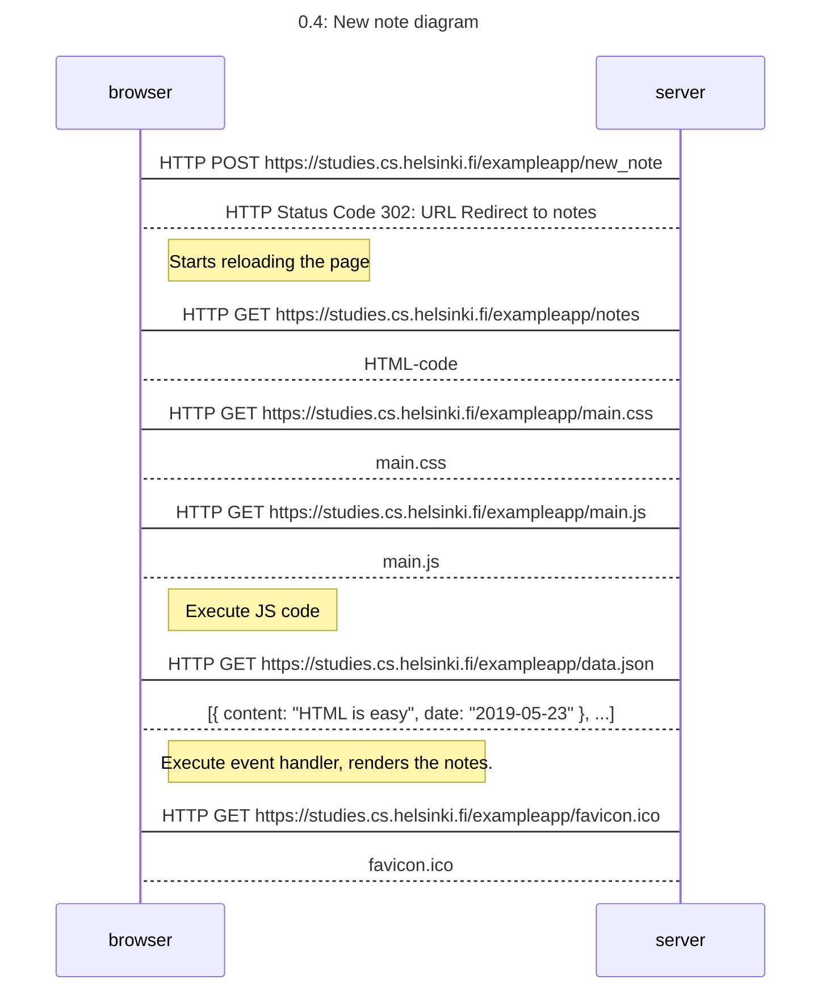

```mermaid
sequenceDiagram
    title 0.4: New note diagram

    browser->server: HTTP POST https://studies.cs.helsinki.fi/exampleapp/new_note
    server-->browser: HTTP Status Code 302: URL Redirect to notes

    note right of browser: Starts reloading the page

    browser->server: HTTP GET https://studies.cs.helsinki.fi/exampleapp/notes
    server-->browser: HTML-code
    browser->server: HTTP GET https://studies.cs.helsinki.fi/exampleapp/main.css
    server-->browser: main.css
    browser->server: HTTP GET https://studies.cs.helsinki.fi/exampleapp/main.js
    server-->browser: main.js

    note right of browser: Execute JS code 

    browser->server: HTTP GET https://studies.cs.helsinki.fi/exampleapp/data.json
    server-->browser: [{ content: "HTML is easy", date: "2019-05-23" }, ...]

    note right of browser: Execute event handler, renders the notes. 

    browser->server: HTTP GET https://studies.cs.helsinki.fi/exampleapp/favicon.ico
    server-->browser: favicon.ico
```