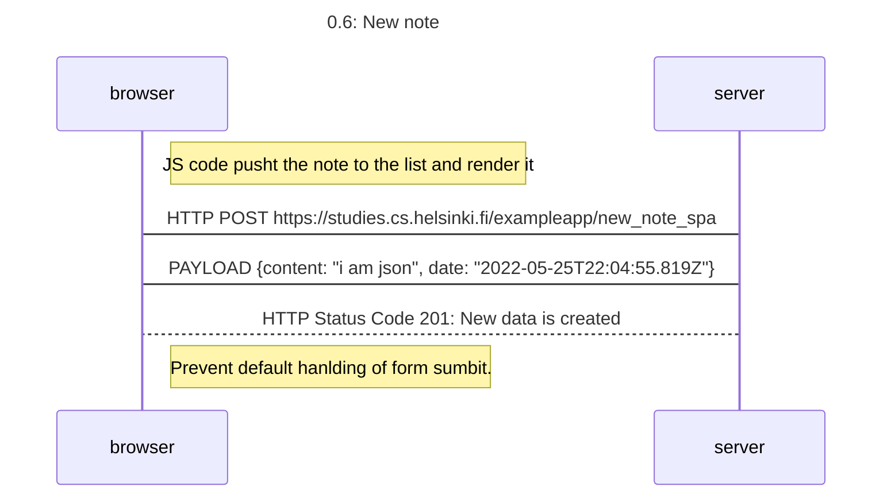

```mermaid
sequenceDiagram
    title 0.6: New note
    
    
    note right of browser: JS code pusht the note to the list and render it
    
    browser->server: HTTP POST https://studies.cs.helsinki.fi/exampleapp/new_note_spa
    browser->server: PAYLOAD {content: "i am json", date: "2022-05-25T22:04:55.819Z"}
    server-->browser: HTTP Status Code 201: New data is created
    
    note right of browser: Prevent default hanlding of form sumbit.
```
